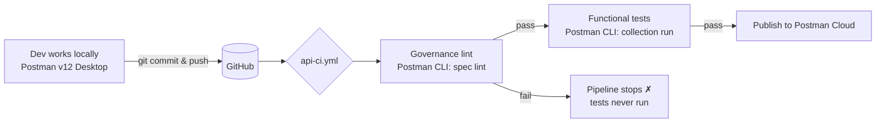

# eng-dev-env

> A Postman **v12** demo repo: your **Git repo is the source of truth** for your API, and the
> **Postman CLI** enforces governance and functional tests as **CI build gates** — the same rules
> you see while you edit run again at the merge gate.

This repo holds a small `account-services` API and *everything Postman needs to govern it* — the
OpenAPI spec, the collection, and the environment — committed right next to the service code.
Same repo, same branches, same PRs. No separate "Postman world."

---

## The idea in one picture



Nobody pushes straight to Postman Cloud. Everything routes through Git and clears the same checks,
which is how Git stays the source of truth.

---

## Repository layout

| Path | What lives here |
| --- | --- |
| `index.yaml` | The OpenAPI spec — the contract Postman governs. Maps 1:1 to the routes the service serves. |
| `src/` | The `account-services` Express app. `src/routes/accounts.js` lines up with the spec. |
| `tests/` | Service tests. |
| `.postman/` | Postman config + the generated collection used for functional testing. |
| `postman/environments/` | Run environments, e.g. `mock-test-account-services.environment.yaml`. |
| `.github/workflows/` | CI — `api-ci.yml` (governance lint → functional tests → optional publish). |
| `Dockerfile` | Container build for the service. |
| `package.json` | Node project + scripts. |

The point: **the API the code serves and the contract Postman governs are the same thing**, in the
same repo.

---

## The API: `account-services`

The collection exercises four operations against a Postman mock server
(`https://<mock-id>.mock.pstmn.io`):

| Method | Path | Operation |
| --- | --- | --- |
| `GET` | `/accounts/{accountNumber}/statement/latest` | Latest Statement |
| `GET` | `/accounts/{accountNumber}/overview` | Account Overview |
| `PATCH` | `/accounts/{accountNumber}/update` | Update Account |
| `DELETE` | `/accounts/{accountNumber}/delete` | Delete Account |

A green run looks like this: **1 iteration · 4 requests · 11 assertions · 0 failed.**

---

## Quick start — run the collection locally

**Prerequisites**

- [Postman CLI](https://learning.postman.com/docs/postman-cli/postman-cli-installation/) installed
- A Postman API key available to the CLI — run `postman login`, or set `POSTMAN_API_KEY`
- Node.js (only if you want to run the service itself)

**Run the functional tests against the mock**

```bash
postman collection run 54544576-857873a8-0ecd-46b9-a7bc-abde03343d2f \
  --environment postman/environments/mock-test-account-services.environment.yaml
```

You'll get the human-readable run summary in your terminal, and the results are pushed back into
Postman Cloud so your team reviews them where they already work.

**Lint the spec against governance rules**

```bash
postman spec lint index.yaml
```

This runs the *same* governance ruleset your platform team owns — the one that fires inline in the
Postman editor — so you can reproduce the merge gate locally before you push.

---

## CI pipeline — `.github/workflows/api-ci.yml`

Two jobs, one ruleset, barely any code:

1. **`governance-lint`** — runs `postman spec lint` against `index.yaml` using the centrally owned
   governance rules. Strictness is configurable (fail on errors only, or fail on warnings too).
2. **`functional-tests`** — runs `postman collection run` against the mock. It declares
   `needs: governance-lint`, so **the tests only run if governance passes.** Non-compliant code
   never reaches the test stage.

```yaml
jobs:
  governance-lint:
    # postman spec lint index.yaml  (platform team's rules)

  functional-tests:
    needs: governance-lint          # gate: only runs if lint passes
    # postman collection run <collection-id> --environment <env.yaml>
```

You can stop here, or add a step after the tests pass to publish the validated collection to
Postman Cloud — making the collection a build artifact of code that already cleared your gates.

---

## Governance: guide inline, gate at merge

The governance rules aren't a separate review step. They're defined once, centrally, and surface as
you work:

- **Warnings guide, they don't block.** Example: three of four operations missing a `5xx` response
  is flagged inline without halting anyone — and the platform team sees that coverage gap across the
  whole API surface.
- **Errors gate.** Remove the `security` block from the spec and it becomes an error inline — and
  the *same* rule fails the merge gate via the Postman CLI, so the pipeline hard-stops and functional
  tests never run.

```yaml
# index.yaml — required for the lint gate to pass
security:
  - bearerAuth: []
```

One ruleset, enforced in your editor **and** at the gate.

---

## Two supported models

Which setup fits you comes down to one question: **where does your authoritative version live?**

**Model 1 — Git is the source of truth** *(this repo)*
Dev authors locally in Postman v12 Desktop → commits & pushes to Git → GitHub Actions runs
governance lint + functional tests → only on pass does it publish to Postman Cloud. The pipeline
stays in charge and the whole thing automates.

**Model 2 — Postman Cloud is the source of truth** *(non-git orgs / pre-v12)*
Dev authors in Postman → the same governance lint runs in-platform → the same collection tests run
through the CLI → only validated changes ship. Same gates, same rigor; the canonical copy just lives
in Postman instead of Git.

---

*This is a demonstration environment for the Postman v12 native-Git + CLI workflow. The mock server,
collection ID, and account data are sample values for the demo.*
